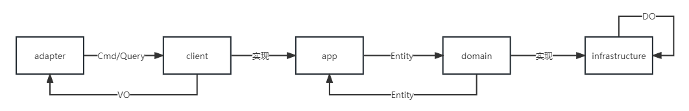

# Smile

## 项目介绍

使用SpringBoot+MybaitsPlus+Cola（整洁面向对象分层架构）4.0重构订单功能

## 项目地址

> Gitee：[https://gitee.com/charles_ruan/smile-cola](https://gitee.com/charles_ruan/smile-cola)
>
> Github：[https://github.com/charles0719/smile-cola](https://github.com/charles0719/smile-cola)

## 项目核心API

- 新增

> POST http://localhost:8080/order/add

```json
{
    "orderInfo": "订单1号1112",
    "orderNo": "111211",
    "description": "我是一个订单"
}
```

- 修改

> POST http://localhost:8080/order/edit

```json
{
    "id": "1",
    "orderInfo": "订单1号1112",
    "orderNo": "111211",
    "description": "我是一个订单"
}
```

- 访问详情

> GET  http://localhost:8080/order/1

- 分页查询

> POST http://localhost:8080/order/page

```json
{
    "pageSize": 10,
    "pageIndex": 1
}
```

## Cola架构介绍

### 核心组件


### 交互过程



### COLA 规范

| 规范             | 用途                | 解释                                          |
| ---------------- | ------------------- | --------------------------------------------- |
| xxxCO            | Client Object       | 客户对象，用于传输数据，等同于DTO             |
| xxxCmd           | Client Request      | Cmd代表Command，表示一个写请求                |
| xxxQuery         | Client Request      | Query，表示一个读请求                         |
| xxxCmdExe        | Command Executor    | 命令模式，每一个写请求对应一个执行器          |
| xxxQueryExe      | Query Executor      | 命令模式，每一个读请求对应一个执行器          |
| xxxVO            | Value Object        | 值对象                                        |
| xxxEntity        | Entity              | 领域实体                                      |
| xxxDO            | Data Object         | 数据对象，用于持久化                          |
| xxxInterceptor   | Command Interceptor | 拦截器，用于处理切面逻辑                      |
| IxxxService      | API Service         | xxxServiceI 不太习惯，就把 I 放在前边吧       |
| xxxDomainService | Domain Service      | 需要多个领域对象协作时，使用DomainService     |
| xxxValidator     | Validator           | 校验器，用于校验的类                          |
| xxxAssembler     | Assembler           | 组装器，DTO <---> Entity，用于Application层   |
| xxxConvertor     | Convertor           | 转化器，Entity <---> DO，用于Infrastructure层 |

### 模块规范


## 使用COLA

COLA 开源地址： https://github.com/alibaba/COLA

**安装 cola archetype**
下载cola-archetypes下的源码到本地，然后本地运行mvn install安装。

**安装 cola components**
下载cola-components下的源码到本地，然后本地运行mvn install安装。

**创建应用**

```sh
mvn archetype:generate  -DgroupId=com.charles -DartifactId=smile -Dversion=1.0.0-SNAPSHOT -Dpackage=com.charles.smile -DarchetypeArtifactId=cola-framework-archetype-web -DarchetypeGroupId=com.alibaba.cola -DarchetypeVersion=4.0.0 -DarchetypeCatalog=internal
```


## 参考

- [https://github.com/alibaba/COLA](https://github.com/alibaba/COLA)
- [https://github.com/AmosWang0626/think-cola](https://github.com/AmosWang0626/think-cola)
- [https://gitee.com/j3code/lucky-draw-v1](https://gitee.com/j3code/lucky-draw-v1)
- [复杂度应对之道 - COLA应用架构](https://blog.csdn.net/significantfrank/article/details/85785565)
- [COLA 4.0：应用架构的最佳实践](https://blog.csdn.net/significantfrank/article/details/110934799)

